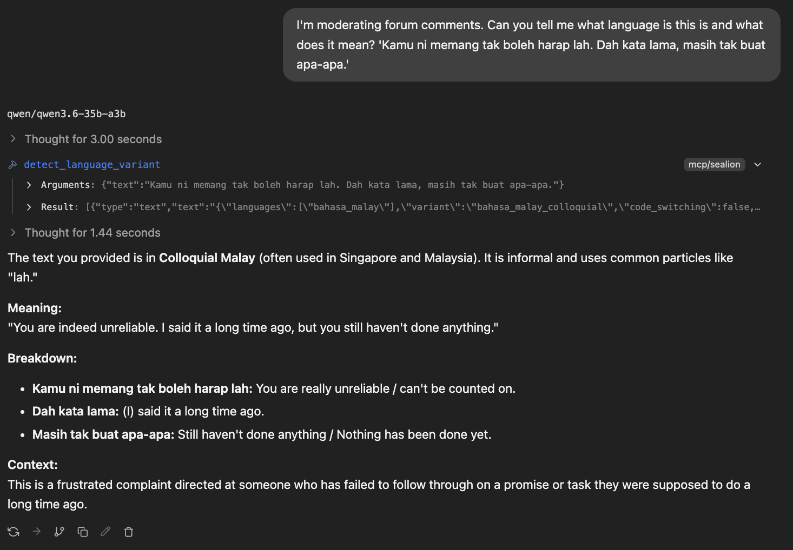
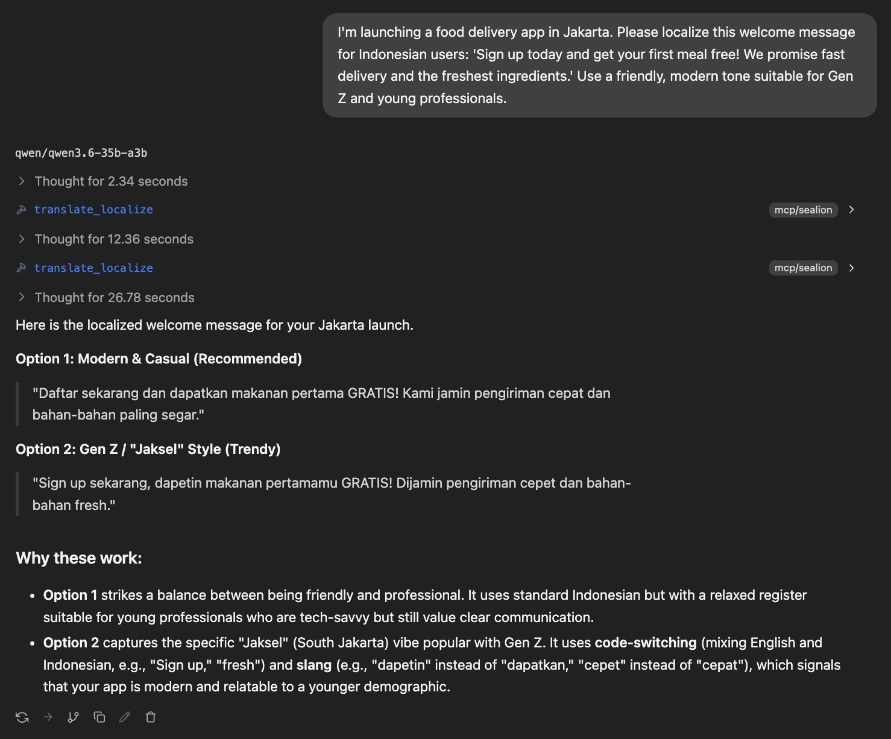
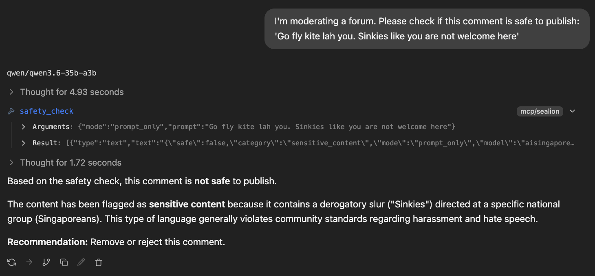
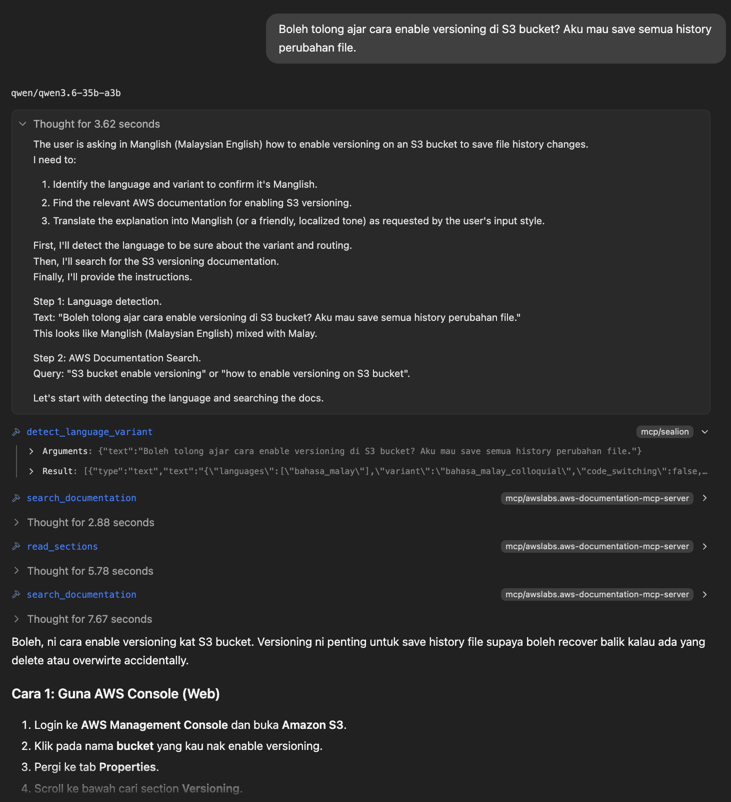

# SEA-LION Sidecar

An MCP server exposing Southeast Asian language tools — variant detection, translation + localization, and safety classification — backed by AI Singapore's hosted SEA-LION API.

**What this is.** A specialist sidecar for agents, not a replacement for your main model. Your assistant keeps doing general reasoning; SEA-LION gets called when Southeast Asian language, culture, or safety is the bottleneck.

**Status.** v0.1, pre-alpha. Three tools, MCP stdio and HTTP transports, hosted backend only. See `CLAUDE.md` for the v0.1 plan.

## Tools

| Tool | Use it when |
|------|-------------|
| `detect_language_variant` | Routing primitive. Call first — returns language, regional variant (e.g. `singapore_colloquial_english`), code-switching flag, register. |
| `translate_localize` | Translation **plus** localization notes. The notes are the differentiator — every non-literal choice is surfaced for review. Supports tone and reading-level controls. |
| `safety_check` | SEA-Guard wrapper. Three modes: `prompt_only`, `prompt_response`, `response_only`. Returns `{safe, category, raw_output}` where `category` is the stable enum `safe \| sensitive_content`. **Advisory only — not a decisional moderation system.** |

## Examples

The following examples show the tools in action inside LM Studio.

**Colloquial Malay detection** — the host agent identifies `bahasa_malay_colloquial` and explains the meaning and cultural context of an informal complaint.



**Jakarta localization** — `translate_localize` produces two register variants: standard Indonesian and Gen Z / "Jaksel" style with code-switching, with notes on why each choice works for the target demographic.



**Singlish safety check** — `safety_check` flags a forum comment containing a derogatory nationalities slur, returning `safe: false, category: sensitive_content`, without the host model needing to know the SEA context itself.



**Manglish + AWS docs** — the host agent runs `detect_language_variant` first (Manglish code-switching), then searches AWS documentation, and finally answers the S3 versioning question back in the user's own register.



## Try it out

To try out the MCP server, [get a SEA-LION API key](#get-an-api-key) and proceed to [set up your AI interface](#wire-into-your-agent), using `https://api.sea-lion.ai/mcp/sealion` as the server URL, and insert your API key as per the setup instructions.

To deploy your own MCP server, proceed with the following instructions from <u>[Install](#install)</u> onwards.

## Install

```bash
git clone https://github.com/aisingapore/sealion-sidecar.git
cd sealion-sidecar
uv sync
```

Requires Python 3.13+. [`uv`](https://github.com/astral-sh/uv) is the recommended package manager.

## Get an API key

1. Sign in at the [SEA-LION Playground](https://playground.sea-lion.ai/) with Google.
2. Open the API Key Manager and generate a key. **Copy or download it immediately** — you can't view it again.
3. Export it:

   ```bash
   export SEALION_API_KEY=sk-...
   ```

   Add it to your shell rc for persistence.

Rate limit is 10 requests/minute per user as of March 2025. Contact `sealion@aisingapore.org` for an increase before a demo.

## Configure

**Local deployment** (stdio or direct `sealion mcp`):

```bash
mkdir -p ~/.sealion
cp config.example.yaml ~/.sealion/config.yaml
```

**Docker** — copy to the repo root instead; it gets volume-mounted into the container:

```bash
cp config.example.yaml config.yaml
```

Edit profiles or routing as needed. Four profiles ship pre-wired:

| Profile | Model | Used by |
|---------|-------|---------|
| `standard` | Gemma-SEA-LION v4 27B | `detect_language_variant`, default fallback |
| `best-language` | Gemma-SEA-LION v4 27B | `translate_localize` |
| `reasoning` | Llama-SEA-LION v3.5 70B (`thinking_mode: on`) | _(none in v0.1 — reserved for future tools)_ |
| `safety` | `aisingapore/SEA-Guard` alias | `safety_check`. Pin to `aisingapore/Gemma-SEA-Guard-12B-2602` for the explicit largest variant. |

## Sanity check

```bash
uv run sealion doctor
```

Verifies config loads, the API key is set, the endpoint is reachable, and every configured profile resolves to a model present in `/v1/models`. Sample output:

```
SEA-LION Sidecar — sealion doctor

config       /Users/you/.sealion/config.yaml                OK
api key      SEALION_API_KEY                                OK
api          https://api.sea-lion.ai/v1                     OK (12 models available)

profiles
  standard         aisingapore/Gemma-SEA-LION-v4-27B-IT    OK
  best-language    aisingapore/Gemma-SEA-LION-v4-27B-IT    OK
  reasoning        aisingapore/Llama-SEA-LION-v3.5-70B-R   OK
  safety           aisingapore/SEA-Guard                   OK

All checks passed.
```

## Server deployment

Run the sidecar as a persistent HTTP server that multiple clients connect to over the network. The server holds no API key — each user passes their own AISG key as a header.

```bash
sealion mcp --port 8000
```

This starts an HTTP server on `0.0.0.0:8000` using the `streamable-http` transport (MCP spec 2025-03-26). Options:

```bash
sealion mcp --host 127.0.0.1 --port 9000          # custom host/port
sealion mcp --transport sse --port 8000            # older SSE protocol, for clients that don't yet support streamable-http
sealion mcp --transport stdio                      # local subprocess mode (see below)
```

Clients connect to `http://your-server:8000/mcp` and include their key as a header. See each client's setup below.

**API key fallback.** By default the server rejects any request that arrives without an `Authorization: Bearer` header. If you want the server to fall back to its own env key for unauthenticated requests (e.g. a private internal deployment where clients don't supply keys), set `allow_env_key_fallback: true` in `config.yaml` under `api:`, or export `SEALION_ALLOW_ENV_KEY_FALLBACK=true` before starting the server. When a valid Bearer key is present it is always used regardless of this flag.

## Docker

Requires [Docker](https://docs.docker.com/get-docker/) with the Compose plugin.

**1. Create a config file** (the container expects it at `./config.yaml`):

```bash
cp config.example.yaml config.yaml
# edit profiles or routing as needed
```

`config.yaml` is gitignored — it's instance-specific. The API key does **not** go here; clients pass it per-request as a header.

**2. Start the server:**

```bash
docker compose up --build
```

The server starts on `http://localhost:8000/mcp`. On subsequent starts, omit `--build` unless you've changed the source.

**3. Verify it's running:**

```bash
docker compose exec sealion sealion doctor
```

**Connecting an MCP client** is the same as server-hosted mode — point it at `http://your-host:8000/mcp` with `Authorization: Bearer sk-...`. See [Wire into your agent](#wire-into-your-agent) below.

**Custom port:**

```bash
# docker-compose.yaml → ports: "9000:8000"
# or override at runtime:
PORT=9000 docker compose up
```

**Switching to SSE transport** (for clients that don't support streamable-http yet):

```yaml
# docker-compose.yaml
command: ["sealion", "mcp", "--transport", "sse", "--host", "0.0.0.0", "--port", "8000"]
```

## Wire into your agent

### Claude Desktop — server-hosted

Edit `~/Library/Application Support/Claude/claude_desktop_config.json` (macOS) or `%APPDATA%\Claude\claude_desktop_config.json` (Windows):

```json
{
  "mcpServers": {
    "sealion": {
      "type": "streamable-http",
      "url": "https://your-server:8000/mcp",
      "headers": {
        "Authorization": "Bearer sk-..."
      }
    }
  }
}
```

Restart Claude Desktop. The three tools appear in the tools panel.
> Ensure that your server URL has SSL certification (begins with `https://`), if not you might not be able to configure the MCP server.

### Claude Desktop — local (stdio)

Spawns the sidecar as a subprocess on your machine. Use this if you're running the sidecar locally rather than connecting to a server.

```json
{
  "mcpServers": {
    "sealion": {
      "command": "uv",
      "args": ["--directory", "/absolute/path/to/SEA-LION_mcp", "run", "sealion", "mcp", "--transport", "stdio"],
      "env": {
        "SEALION_API_KEY": "sk-..."
      }
    }
  }
}
```

### Claude Code — server-hosted

```bash
claude mcp add --transport http sealion http://your-server:8000/mcp \
  --header "Authorization: Bearer sk-..."
```

### Claude Code — local (stdio)

```bash
claude mcp add sealion -- uv --directory /absolute/path/to/SEA-LION_mcp \
  run sealion mcp --transport stdio
```

Set the API key in your shell environment (`export SEALION_API_KEY=sk-...`) before starting Claude Code, or add it to your shell rc.

### Cursor — server-hosted

Edit `~/.cursor/mcp.json`:

```json
{
  "mcpServers": {
    "sealion": {
      "type": "streamable-http",
      "url": "http://your-server:8000/mcp",
      "headers": {
        "Authorization": "Bearer sk-..."
      }
    }
  }
}
```

### Cursor — local (stdio)

```json
{
  "mcpServers": {
    "sealion": {
      "command": "uv",
      "args": ["--directory", "/absolute/path/to/SEA-LION_mcp", "run", "sealion", "mcp", "--transport", "stdio"],
      "env": {
        "SEALION_API_KEY": "sk-..."
      }
    }
  }
}
```

### Hermes — server-hosted

```bash
hermes mcp add sealion \
  --url http://your-server:8000/mcp \
  --header "Authorization=Bearer sk-..."
hermes mcp test sealion
```

### Hermes — local (stdio)

```bash
hermes mcp add sealion \
  --command "uv --directory /absolute/path/to/SEA-LION_mcp run sealion mcp --transport stdio"
hermes mcp test sealion
```

### LM Studio — server-hosted

Open **LM Studio → Developer tab → MCP Servers**, click **Add**, and paste:

```json
{
  "mcpServers": {
    "sealion": {
      "type": "streamable-http",
      "url": "http://your-server:8000/mcp",
      "headers": {
        "Authorization": "Bearer sk-..."
      }
    }
  }
}
```

Save, then select a model and start a chat. The three tools appear in the tool-call panel.

### LM Studio — local (stdio)

In the same **MCP Servers** panel, add:

```json
{
  "mcpServers": {
    "sealion": {
      "command": "uv",
      "args": ["--directory", "/absolute/path/to/SEA-LION_mcp", "run", "sealion", "mcp", "--transport", "stdio"],
      "env": {
        "SEALION_API_KEY": "sk-..."
      }
    }
  }
}
```

LM Studio spawns the sidecar as a subprocess. No separate server process needed.

## Evals

One eval per tool, runnable locally:

```bash
uv run python -m sealion_sidecar.evals.detect_language_variant
uv run python -m sealion_sidecar.evals.safety_check
uv run python -m sealion_sidecar.evals.translate_localize
```

Each prints input → SEA-LION output → expected → PASS/FAIL on a small embedded dataset (4–6 examples). To compare against Claude:

```bash
uv sync --extra evals
export ANTHROPIC_API_KEY=sk-ant-...
uv run python -m sealion_sidecar.evals.detect_language_variant --baseline claude
```

Datasets are intentionally small — easy to grow as you find regressions. Mind the 10 req/min rate limit (evals run sequentially with retry-aware backoff).

## Development

```bash
uv sync --extra dev
uv run pytest
uv run ruff check sealion_sidecar/ tests/
```

Adding a new tool means files in three parallel locations:

```
sealion_sidecar/
  schemas/<tool>.input.json
  schemas/<tool>.output.json
  prompts/<tool>.md
  tasks/<tool>.py            # NAME, DESCRIPTION, input_schema(), async run()
  evals/<tool>.py
```

Then add a `@mcp.tool()` decorated handler inside `build_mcp()` in `mcp_server.py`, import the task module there, and add a routing entry in `config.example.yaml`.

## Limitations

- **Rate limit.** 10 req/min per user for the SEA-LION API Key still applies to MCP calls as well.
- **`safety_check` is advisory.** SEA-Guard is a classifier, not a decisional moderation system. The `category` enum is intentionally two-value (`safe`, `sensitive_content`) — read `raw_output` for richer detail.
- **No streaming.** Tools return single responses. 

## Routing policy (for the host agent)

**Call SEA-LION when** a SEA language, regional slang or dialect, translation/localization for a SEA audience, regional safety moderation, or low-latency voice with local fluency is involved.

**Don't call SEA-LION for** general world knowledge, long strategic reasoning without a SEA dimension, or final high-stakes advice without verification.

The pattern: run `detect_language_variant` first; route to the right tool based on what comes back. This is what makes the sidecar a sidecar instead of a replacement.

